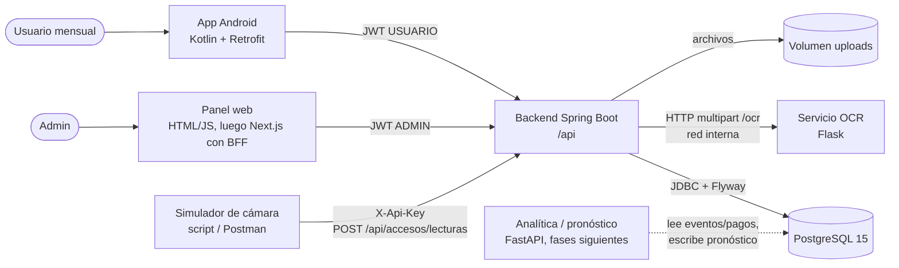
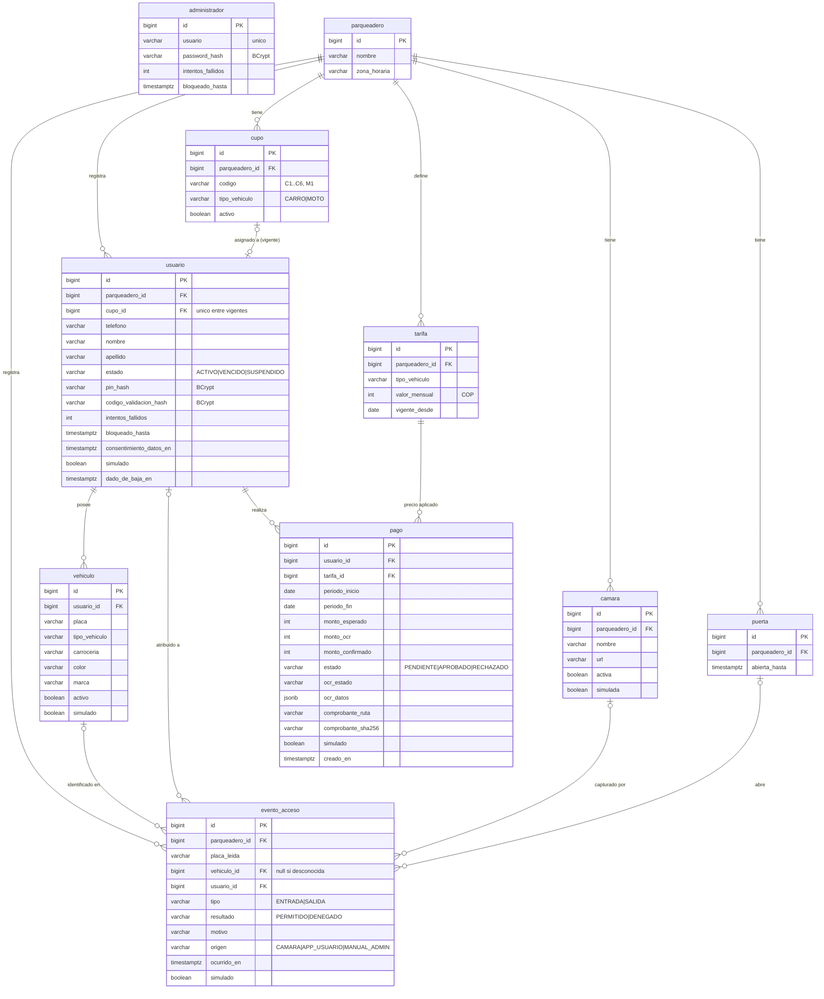
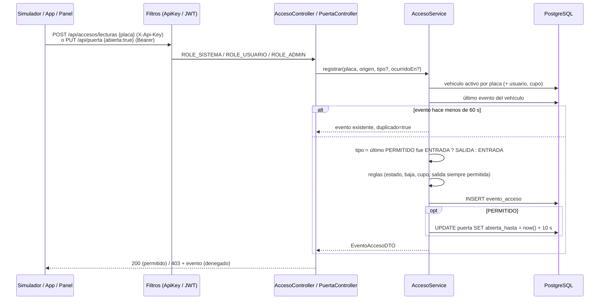

# Fase 1 — Modelo de datos, esquema V1 y contratos de API

Decisiones de soporte: ADR 0001 (Flyway), 0002 (modelo), 0003 (autenticación), 0004 (accesos), 0005 (comprobantes)
y 0006 (vencimiento), en `docs/adr/`. Este documento es la referencia de implementación; si contradice un ADR,
manda el ADR y hay que corregir este documento.

> **Estado:** implementado en la rama `fase-1-backend`. Este documento ya incluye las resoluciones del orquestador
> y del dueño tomadas durante la implementación (tabla `administrador`, tarifas confirmadas, periodo recalculado al
> aprobar, `YA_DENTRO`, apertura forzada del admin, privacidad de `GET /api/puerta`, aviso de privacidad). Los
> requisitos y criterios de aceptación están en `docs/requisitos/fase-1-backend.md`.

Escala de diseño: 1 parqueadero, 7 cupos, 7 usuarios, menos de 50 eventos de acceso al día, 7 pagos al mes. Todo
cabe en una instancia de Spring Boot y una de PostgreSQL. No se introduce caché, cola, Redis ni réplicas (ver
"Qué no se hace" al final).

## 1. Contenedores (C4 nivel 2)



## 2. Diagrama entidad-relación



## 3. DDL propuesto — `src/main/resources/db/migration/V1__esquema_inicial.sql`

Convenciones: `bigint GENERATED BY DEFAULT AS IDENTITY` (compatible con `GenerationType.IDENTITY` y permite
insertar el id 1 en las semillas); enums como `varchar` + `CHECK`; dinero en `integer` (pesos); instantes en
`timestamptz`; periodos en `date`. Los tipos están elegidos para que `ddl-auto=validate` no falle:
`integer` ↔ `Integer`, `bigint` ↔ `Long`, `timestamptz` ↔ `Instant`/`OffsetDateTime`, `date` ↔ `LocalDate`,
`jsonb` ↔ `Map<String,Object>` con `@JdbcTypeCode(SqlTypes.JSON)`. No se usa `char(n)` ni `smallint`, que
dan falsos errores de validación con `String`/`Integer`.

```sql
-- V1__esquema_inicial.sql — Fase 1. Esquema completo (reset, sin baseline del modelo anterior).

CREATE TABLE parqueadero (
    id            bigint GENERATED BY DEFAULT AS IDENTITY PRIMARY KEY,
    nombre        varchar(80)  NOT NULL,
    zona_horaria  varchar(40)  NOT NULL DEFAULT 'America/Bogota',
    creado_en     timestamptz  NOT NULL DEFAULT now()
);

-- Administradores del panel. Hoy hay uno, creado al arrancar desde ADMIN_USERNAME/ADMIN_PASSWORD
-- (solo se guarda el hash BCrypt). Mismo bloqueo por intentos que los usuarios.
CREATE TABLE administrador (
    id                 bigint GENERATED BY DEFAULT AS IDENTITY PRIMARY KEY,
    usuario            varchar(50)  NOT NULL,
    password_hash      varchar(60)  NOT NULL,
    intentos_fallidos  integer      NOT NULL DEFAULT 0,
    bloqueado_hasta    timestamptz,
    creado_en          timestamptz  NOT NULL DEFAULT now(),
    actualizado_en     timestamptz  NOT NULL DEFAULT now(),
    CONSTRAINT uq_administrador_usuario  UNIQUE (usuario),
    CONSTRAINT ck_administrador_intentos CHECK (intentos_fallidos >= 0)
);

CREATE TABLE cupo (
    id              bigint GENERATED BY DEFAULT AS IDENTITY PRIMARY KEY,
    parqueadero_id  bigint       NOT NULL REFERENCES parqueadero (id),
    codigo          varchar(10)  NOT NULL,
    tipo_vehiculo   varchar(10)  NOT NULL,
    activo          boolean      NOT NULL DEFAULT true,
    creado_en       timestamptz  NOT NULL DEFAULT now(),
    CONSTRAINT ck_cupo_tipo   CHECK (tipo_vehiculo IN ('CARRO', 'MOTO')),
    CONSTRAINT uq_cupo_codigo UNIQUE (parqueadero_id, codigo)
);

CREATE TABLE usuario (
    id                           bigint GENERATED BY DEFAULT AS IDENTITY PRIMARY KEY,
    parqueadero_id               bigint       NOT NULL REFERENCES parqueadero (id),
    cupo_id                      bigint       REFERENCES cupo (id),
    telefono                     varchar(15)  NOT NULL,
    nombre                       varchar(50)  NOT NULL,
    apellido                     varchar(50)  NOT NULL,
    estado                       varchar(12)  NOT NULL DEFAULT 'VENCIDO',
    suspendido_motivo            varchar(200),
    pin_hash                     varchar(60),
    codigo_validacion_hash       varchar(60),
    codigo_validacion_expira_en  timestamptz,
    validado_en                  timestamptz,
    intentos_fallidos            integer      NOT NULL DEFAULT 0,
    bloqueado_hasta              timestamptz,
    consentimiento_datos_en      timestamptz,
    consentimiento_version       varchar(20),
    simulado                     boolean      NOT NULL DEFAULT false,
    dado_de_baja_en              timestamptz,
    creado_en                    timestamptz  NOT NULL DEFAULT now(),
    actualizado_en               timestamptz  NOT NULL DEFAULT now(),
    CONSTRAINT ck_usuario_estado     CHECK (estado IN ('ACTIVO', 'VENCIDO', 'SUSPENDIDO')),
    CONSTRAINT ck_usuario_telefono   CHECK (telefono ~ '^\+?[0-9]{7,15}$'),
    CONSTRAINT ck_usuario_intentos   CHECK (intentos_fallidos >= 0),
    CONSTRAINT ck_usuario_suspension CHECK (estado <> 'SUSPENDIDO' OR suspendido_motivo IS NOT NULL),
    -- Validado implica PIN y consentimiento (Ley 1581).
    CONSTRAINT ck_usuario_validado   CHECK (validado_en IS NULL
                                            OR (pin_hash IS NOT NULL AND consentimiento_datos_en IS NOT NULL)),
    -- Dado de baja implica cupo liberado.
    CONSTRAINT ck_usuario_baja       CHECK (dado_de_baja_en IS NULL OR cupo_id IS NULL)
);
-- Unicidad de negocio solo entre usuarios reales y vigentes: deja convivir bajas e histórico simulado.
CREATE UNIQUE INDEX uq_usuario_telefono_vigente ON usuario (telefono)
    WHERE dado_de_baja_en IS NULL AND NOT simulado;
CREATE UNIQUE INDEX uq_usuario_cupo_vigente ON usuario (cupo_id)
    WHERE cupo_id IS NOT NULL AND dado_de_baja_en IS NULL AND NOT simulado;
CREATE INDEX ix_usuario_parqueadero_estado ON usuario (parqueadero_id, estado)
    WHERE dado_de_baja_en IS NULL;

CREATE TABLE vehiculo (
    id             bigint GENERATED BY DEFAULT AS IDENTITY PRIMARY KEY,
    usuario_id     bigint       NOT NULL REFERENCES usuario (id),
    placa          varchar(10)  NOT NULL,
    tipo_vehiculo  varchar(10)  NOT NULL,
    carroceria     varchar(15),
    color          varchar(30)  NOT NULL,
    marca          varchar(40),
    activo         boolean      NOT NULL DEFAULT true,
    simulado       boolean      NOT NULL DEFAULT false,
    creado_en      timestamptz  NOT NULL DEFAULT now(),
    -- Placa normalizada por el backend (mayúsculas, sin espacios ni guiones). El formato colombiano
    -- exacto por tipo (CARRO AAA999, MOTO AAA99 / AAA99A) se valida en el servicio.
    CONSTRAINT ck_vehiculo_placa      CHECK (placa ~ '^[A-Z0-9]{5,7}$'),
    CONSTRAINT ck_vehiculo_tipo       CHECK (tipo_vehiculo IN ('CARRO', 'MOTO')),
    CONSTRAINT ck_vehiculo_carroceria CHECK (carroceria IN ('SEDAN', 'HATCHBACK', 'SUV', 'PICKUP', 'VAN',
                                                            'COUPE', 'OTRO')),
    -- Carrocería obligatoria para carro; las motos no la usan en Fase 1.
    CONSTRAINT ck_vehiculo_carroceria_tipo CHECK ((tipo_vehiculo = 'CARRO' AND carroceria IS NOT NULL)
                                                  OR (tipo_vehiculo = 'MOTO' AND carroceria IS NULL))
);
CREATE UNIQUE INDEX uq_vehiculo_placa_activa ON vehiculo (placa)
    WHERE activo AND NOT simulado;
CREATE UNIQUE INDEX uq_vehiculo_usuario_activo ON vehiculo (usuario_id)
    WHERE activo AND NOT simulado;
CREATE INDEX ix_vehiculo_usuario ON vehiculo (usuario_id);

CREATE TABLE tarifa (
    id              bigint GENERATED BY DEFAULT AS IDENTITY PRIMARY KEY,
    parqueadero_id  bigint       NOT NULL REFERENCES parqueadero (id),
    tipo_vehiculo   varchar(10)  NOT NULL,
    valor_mensual   integer      NOT NULL,
    vigente_desde   date         NOT NULL,
    creado_en       timestamptz  NOT NULL DEFAULT now(),
    CONSTRAINT ck_tarifa_tipo  CHECK (tipo_vehiculo IN ('CARRO', 'MOTO')),
    CONSTRAINT ck_tarifa_valor CHECK (valor_mensual > 0),
    -- Tarifa vigente en F = la de mayor vigente_desde <= F. Este índice sirve a esa búsqueda.
    CONSTRAINT uq_tarifa_vigencia UNIQUE (parqueadero_id, tipo_vehiculo, vigente_desde)
);

CREATE TABLE pago (
    id                  bigint GENERATED BY DEFAULT AS IDENTITY PRIMARY KEY,
    usuario_id          bigint        NOT NULL REFERENCES usuario (id),
    tarifa_id           bigint        NOT NULL REFERENCES tarifa (id),
    periodo_inicio      date          NOT NULL,
    periodo_fin         date          NOT NULL,
    monto_esperado      integer       NOT NULL,
    monto_ocr           integer,
    fecha_pago_ocr      date,
    ocr_estado          varchar(10)   NOT NULL,
    ocr_datos           jsonb,
    monto_confirmado    integer,
    estado              varchar(10)   NOT NULL DEFAULT 'PENDIENTE',
    motivo_rechazo      varchar(200),
    observacion         varchar(200),
    registrado_por      varchar(10)   NOT NULL,
    comprobante_ruta    varchar(255),
    comprobante_tipo    varchar(30),
    comprobante_sha256  varchar(64),
    posible_duplicado   boolean       NOT NULL DEFAULT false,
    revisado_en         timestamptz,
    simulado            boolean       NOT NULL DEFAULT false,
    creado_en           timestamptz   NOT NULL DEFAULT now(),
    actualizado_en      timestamptz   NOT NULL DEFAULT now(),
    CONSTRAINT ck_pago_estado        CHECK (estado IN ('PENDIENTE', 'APROBADO', 'RECHAZADO')),
    CONSTRAINT ck_pago_ocr_estado    CHECK (ocr_estado IN ('EXITOSO', 'PARCIAL', 'FALLIDO', 'NO_APLICA')),
    CONSTRAINT ck_pago_registrado    CHECK (registrado_por IN ('USUARIO', 'ADMIN')),
    CONSTRAINT ck_pago_periodo       CHECK (periodo_fin >= periodo_inicio),
    CONSTRAINT ck_pago_montos        CHECK (monto_esperado >= 0
                                            AND (monto_ocr IS NULL OR monto_ocr >= 0)
                                            AND (monto_confirmado IS NULL OR monto_confirmado >= 0)),
    CONSTRAINT ck_pago_revision      CHECK (estado = 'PENDIENTE' OR revisado_en IS NOT NULL),
    CONSTRAINT ck_pago_aprobado      CHECK (estado <> 'APROBADO' OR monto_confirmado IS NOT NULL),
    CONSTRAINT ck_pago_rechazado     CHECK (estado <> 'RECHAZADO' OR motivo_rechazo IS NOT NULL),
    CONSTRAINT ck_pago_comprobante   CHECK (comprobante_ruta IS NULL
                                            OR (comprobante_sha256 IS NOT NULL AND comprobante_tipo IS NOT NULL)),
    CONSTRAINT ck_pago_sha256        CHECK (comprobante_sha256 IS NULL OR comprobante_sha256 ~ '^[0-9a-f]{64}$')
);
-- Un solo pago pendiente por usuario real.
CREATE UNIQUE INDEX uq_pago_pendiente_usuario ON pago (usuario_id)
    WHERE estado = 'PENDIENTE' AND NOT simulado;
-- No se aprueban dos pagos para el mismo periodo.
CREATE UNIQUE INDEX uq_pago_aprobado_periodo ON pago (usuario_id, periodo_inicio)
    WHERE estado = 'APROBADO';
-- Último periodo aprobado (cálculo del siguiente periodo y del vencimiento).
CREATE INDEX ix_pago_usuario_periodo_fin ON pago (usuario_id, periodo_fin DESC);
-- Bandeja de revisión del admin.
CREATE INDEX ix_pago_estado_creado ON pago (estado, creado_en DESC);
CREATE INDEX ix_pago_sha256 ON pago (comprobante_sha256) WHERE comprobante_sha256 IS NOT NULL;

CREATE TABLE puerta (
    id              bigint GENERATED BY DEFAULT AS IDENTITY PRIMARY KEY,
    parqueadero_id  bigint       NOT NULL REFERENCES parqueadero (id),
    nombre          varchar(50)  NOT NULL,
    -- abierta = abierta_hasta > now(). No hace falta un job de cierre.
    abierta_hasta   timestamptz,
    actualizado_en  timestamptz  NOT NULL DEFAULT now()
);

CREATE TABLE camara (
    id              bigint GENERATED BY DEFAULT AS IDENTITY PRIMARY KEY,
    parqueadero_id  bigint        NOT NULL REFERENCES parqueadero (id),
    nombre          varchar(50)   NOT NULL,
    url             varchar(200),
    activa          boolean       NOT NULL DEFAULT true,
    simulada        boolean       NOT NULL DEFAULT true,
    creado_en       timestamptz   NOT NULL DEFAULT now()
);

CREATE TABLE evento_acceso (
    id              bigint GENERATED BY DEFAULT AS IDENTITY PRIMARY KEY,
    parqueadero_id  bigint        NOT NULL REFERENCES parqueadero (id),
    placa_leida     varchar(15)   NOT NULL,
    vehiculo_id     bigint        REFERENCES vehiculo (id),
    usuario_id      bigint        REFERENCES usuario (id),
    camara_id       bigint        REFERENCES camara (id),
    puerta_id       bigint        REFERENCES puerta (id),
    tipo            varchar(7)    NOT NULL,
    tipo_inferido   boolean       NOT NULL DEFAULT true,
    resultado       varchar(9)    NOT NULL,
    motivo          varchar(25),
    origen          varchar(15)   NOT NULL,
    observacion     varchar(200),
    ocurrido_en     timestamptz   NOT NULL,
    registrado_en   timestamptz   NOT NULL DEFAULT now(),
    simulado        boolean       NOT NULL DEFAULT false,
    CONSTRAINT ck_evento_tipo      CHECK (tipo IN ('ENTRADA', 'SALIDA')),
    CONSTRAINT ck_evento_resultado CHECK (resultado IN ('PERMITIDO', 'DENEGADO')),
    CONSTRAINT ck_evento_origen    CHECK (origen IN ('CAMARA', 'APP_USUARIO', 'MANUAL_ADMIN')),
    CONSTRAINT ck_evento_motivo    CHECK (motivo IN ('PLACA_DESCONOCIDA', 'USUARIO_VENCIDO', 'USUARIO_SUSPENDIDO',
                                                     'USUARIO_DE_BAJA', 'SIN_CUPO', 'TIPO_CUPO_DISTINTO',
                                                     'FORZADO_ADMIN', 'SALIDA_CON_DEUDA', 'YA_DENTRO')),
    CONSTRAINT ck_evento_denegado  CHECK (resultado = 'PERMITIDO' OR motivo IS NOT NULL),
    -- Sin vehículo identificado solo cabe placa desconocida o apertura forzada por el admin.
    -- (motivo IS NOT NULL es necesario: NULL IN (...) da NULL y el CHECK lo dejaría pasar).
    CONSTRAINT ck_evento_vehiculo  CHECK (vehiculo_id IS NOT NULL
                                          OR (motivo IS NOT NULL AND motivo IN ('PLACA_DESCONOCIDA', 'FORZADO_ADMIN')))
);
-- Inferencia ENTRADA/SALIDA, anti-rebote y ocupación: último evento por vehículo.
CREATE INDEX ix_evento_vehiculo_ocurrido ON evento_acceso (vehiculo_id, ocurrido_en DESC);
-- Listados del admin y series temporales de analítica.
CREATE INDEX ix_evento_parqueadero_ocurrido ON evento_acceso (parqueadero_id, ocurrido_en DESC);
-- Historial del usuario en la app.
CREATE INDEX ix_evento_usuario_ocurrido ON evento_acceso (usuario_id, ocurrido_en DESC);
```

### Semillas — `V2__datos_iniciales.sql`

```sql
INSERT INTO parqueadero (id, nombre) VALUES (1, 'Parqueadero principal');

INSERT INTO cupo (parqueadero_id, codigo, tipo_vehiculo) VALUES
    (1, 'C1', 'CARRO'), (1, 'C2', 'CARRO'), (1, 'C3', 'CARRO'),
    (1, 'C4', 'CARRO'), (1, 'C5', 'CARRO'), (1, 'C6', 'CARRO'),
    (1, 'M1', 'MOTO');

-- La de 2025 cubre los 12 meses de datos simulados de la Fase 2; la de 2026 es la vigente. Valores del dueño.
INSERT INTO tarifa (parqueadero_id, tipo_vehiculo, valor_mensual, vigente_desde) VALUES
    (1, 'CARRO', 64000, DATE '2025-01-01'),
    (1, 'CARRO', 80000, DATE '2026-01-01'),
    (1, 'MOTO',   8000, DATE '2025-01-01'),
    (1, 'MOTO',  10000, DATE '2026-01-01');

INSERT INTO puerta (parqueadero_id, nombre) VALUES (1, 'Principal');
INSERT INTO camara (parqueadero_id, nombre, url, activa, simulada) VALUES (1, 'Entrada (simulada)', NULL, true, true);

-- Alinear la secuencia de identidad tras insertar el id explícito.
SELECT setval(pg_get_serial_sequence('parqueadero', 'id'), (SELECT max(id) FROM parqueadero));
```

### Consultas de referencia

```sql
-- Tarifa vigente para un tipo en una fecha.
SELECT * FROM tarifa
WHERE parqueadero_id = :p AND tipo_vehiculo = :tipo AND vigente_desde <= :fecha
ORDER BY vigente_desde DESC LIMIT 1;

-- Ocupación actual: vehículos cuyo último evento PERMITIDO es ENTRADA.
WITH ultimo AS (
    SELECT DISTINCT ON (e.vehiculo_id) e.vehiculo_id, e.tipo
    FROM evento_acceso e
    WHERE e.parqueadero_id = :p AND e.resultado = 'PERMITIDO'
      AND e.vehiculo_id IS NOT NULL AND NOT e.simulado
    ORDER BY e.vehiculo_id, e.ocurrido_en DESC, e.id DESC
)
SELECT v.tipo_vehiculo, count(*) AS ocupados
FROM ultimo u JOIN vehiculo v ON v.id = u.vehiculo_id
WHERE u.tipo = 'ENTRADA'
GROUP BY v.tipo_vehiculo;

-- Job de vencimiento (ADR 0006), idempotente.
UPDATE usuario u SET estado = 'VENCIDO', actualizado_en = now()
WHERE u.estado = 'ACTIVO' AND u.dado_de_baja_en IS NULL AND NOT u.simulado
  AND NOT EXISTS (SELECT 1 FROM pago p
                  WHERE p.usuario_id = u.id AND p.estado = 'APROBADO'
                    AND p.periodo_fin + :diasGracia >= :hoy);
```

## 4. Secuencias clave

### Lectura de placa (cámara simulada, app o panel)



### Pago con comprobante

```mermaid
sequenceDiagram
  participant App
  participant P as PagoService
  participant AL as AlmacenComprobantes
  participant O as OcrService
  participant DB as PostgreSQL
  participant Adm as Panel admin
  App->>P: POST /api/pagos (multipart comprobante, JWT USUARIO)
  P->>P: validar tamaño y tipo por bytes; sha256; ¿duplicado?
  P->>DB: último pago APROBADO, tarifa vigente del tipo del cupo
  P->>P: periodo propuesto (F = hoy) y monto_esperado
  P->>AL: guardar(uuid.ext)
  P->>O: parse (timeout 10 s)
  O-->>P: {fecha, valor} o error -> ocr_estado
  P->>DB: INSERT pago PENDIENTE
  P-->>App: 201 PagoDTO
  Adm->>P: PUT /api/pagos/{id}/aprobar {montoConfirmado}
  P->>P: recalcular periodo con F = fecha de aprobación (y tarifa/monto si cambian)
  P->>DB: estado APROBADO, revisado_en; usuario ACTIVO si cubre hoy y no está SUSPENDIDO
```

## 5. Endpoints de la Fase 1

Prefijo `/api`, **sin `/v1`**: los dos consumidores (app y panel) son del mismo equipo, no hay una base de apps
instaladas que proteger y el reset de BD (ADR 0001) ya invalida los datos y los tokens viejos. Se rompe una sola
vez y se actualizan los consumidores en la misma fase. El versionado (`/api/v2`) se introduce cuando haya una
app publicada que no se pueda actualizar a la vez que el backend.

Errores: `ProblemDetail` (RFC 9457, nativo en Spring 6) desde un `@RestControllerAdvice`. 400 para validación,
401 sin token o token inválido, 403 rol insuficiente o acceso denegado, 404, 409 (duplicado, pago pendiente
existente, cupo ocupado), 423 (usuario bloqueado). Hoy los servicios lanzan `RuntimeException`, que llega como 500.

Leyenda de roles: **P** público, **A** ADMIN, **U** USUARIO (el suyo propio), **S** SISTEMA (API key).

### Autenticación

| Método | Ruta | Rol | Entrada | Salida | Cambio frente a hoy |
|---|---|---|---|---|---|
| POST | `/api/admin/login` | P | `AdminLoginRequest {username, password}` | `TokenDTO {token, rol, expiraEn}` | Hoy devuelve texto plano. Contra la tabla `administrador` (BCrypt, bloqueo 5/15 persistido); `sub` = id del admin |
| POST | `/api/auth/activar` | P | `ActivacionDTO {telefono, codigo, pin, aceptaTratamientoDatos, versionConsentimiento}` | 204 | Sustituye `usuarios/verificar-codigo` y `usuarios/validar` |
| POST | `/api/auth/login` | P | `LoginUsuarioDTO {telefono, pin}` (JSON) | `TokenDTO` | Sustituye `usuarios/login` (que usa query params) |
| GET | `/api/ping` | P | — | `{status}` | Hoy está en `permitAll` pero no hay controlador: se crea uno trivial (healthcheck de Docker) |
| GET | `/api/legal/aviso-privacidad` | P | — | `AvisoPrivacidadDTO {version, texto}` | Nuevo. Texto estático versionado (`src/main/resources/legal/aviso-privacidad-{version}.txt`); la app envía esa `version` en `versionConsentimiento` |

### Usuarios y vehículos

| Método | Ruta | Rol | Entrada | Salida |
|---|---|---|---|---|
| GET | `/api/usuarios?estado=&incluirBajas=` | A | — | `List<UsuarioDTO>` (sin PIN ni código) |
| GET | `/api/usuarios/{id}` | A | — | `UsuarioDetalleDTO {usuario, vehiculo, cupo, ultimoPago, vigenteHasta}` |
| POST | `/api/usuarios` | A | `UsuarioAltaDTO {telefono, nombre, apellido, cupoId, vehiculo: VehiculoDTO}` | 201 `UsuarioAltaRespuestaDTO {usuario, codigoValidacion, codigoExpiraEn}` (el código se ve una sola vez) |
| PUT | `/api/usuarios/{id}` | A | `UsuarioActualizacionDTO {telefono?, nombre?, apellido?, cupoId?}` | `UsuarioDTO` |
| PUT | `/api/usuarios/{id}/vehiculo` | A | `VehiculoDTO {placa, tipoVehiculo, carroceria?, color, marca?}` | `VehiculoDTO` (el anterior pasa a inactivo) |
| PUT | `/api/usuarios/{id}/estado` | A | `CambioEstadoDTO {accion: SUSPENDER\|REACTIVAR, motivo?}` | `UsuarioDTO` |
| POST | `/api/usuarios/{id}/codigo` | A | — | `CodigoValidacionDTO {codigo, expiraEn}` (sirve también para "olvidé mi PIN"; desbloquea) |
| DELETE | `/api/usuarios/{id}` | A | — | 204 (baja lógica, libera el cupo) |
| GET | `/api/usuarios/yo` | U | — | `UsuarioDTO` con vehículo, cupo, estado y `vigenteHasta` |
| PUT | `/api/usuarios/yo/pin` | U | `CambioPinDTO {pinActual, pinNuevo}` | 204 |

Se eliminan: `POST /usuarios/registro` (público), `POST /usuarios/solicitar-validacion` (público, creaba usuarios),
`POST /usuarios/verificar-codigo`, `POST /usuarios/validar` y `POST /usuarios/login`.

`UsuarioDTO`: `{id, telefono, nombre, apellido, estado, suspendidoMotivo, validado, bloqueadoHasta, cupo: {id, codigo, tipoVehiculo}, vehiculo: VehiculoDTO, vigenteHasta, creadoEn}`.
Ya no tiene `pin`, `codigoValidacion`, `verificado` ni `activo` (`validado` sustituye a `verificado`).

### Cupos y tarifas

| Método | Ruta | Rol | Entrada | Salida |
|---|---|---|---|---|
| GET | `/api/cupos` | A | — | `List<CupoDTO {id, codigo, tipoVehiculo, activo, usuarioId?, ocupado}>` (ver definición de `ocupado` abajo) |
| POST | `/api/cupos` | A | `CupoDTO {codigo, tipoVehiculo}` | 201 `CupoDTO` |
| PUT | `/api/cupos/{id}` | A | `{activo}` | `CupoDTO` (409 si se desactiva un cupo asignado) |
| GET | `/api/tarifas?vigentes=true` | A, U | — | `List<TarifaDTO {id, tipoVehiculo, valorMensual, vigenteDesde}>` |
| POST | `/api/tarifas` | A | `TarifaDTO {tipoVehiculo, valorMensual, vigenteDesde}` (`vigenteDesde >= hoy`) | 201 `TarifaDTO` |

Las tarifas no se editan ni se borran: una nueva vigencia sustituye a la anterior.

`CupoDTO.ocupado` (ocupación "comercial", no física): el cupo está asignado a un usuario no dado de baja que está
`ACTIVO`, o `VENCIDO` pero con el fin de su último periodo aprobado todavía dentro de los días de gracia. Un cupo de un
usuario `SUSPENDIDO` o vencido de verdad muestra `usuarioId` pero `ocupado = false`; sigue asignado (para reasignarlo
hay que dar de baja al usuario o cambiarle el cupo). La ocupación física está en `GET /api/accesos/ocupacion`.

### Pagos

| Método | Ruta | Rol | Entrada | Salida |
|---|---|---|---|---|
| GET | `/api/pagos/proximo-periodo` | U | — | `PeriodoDTO {inicio, fin, montoEsperado}` |
| POST | `/api/pagos` | U | multipart `comprobante` (JPEG/PNG, máx. 5 MB) | 201 `PagoDTO` (409 si ya hay uno pendiente o el comprobante está duplicado) |
| POST | `/api/pagos/manual` | A | multipart `{usuarioId, montoConfirmado, observacion, comprobante?}` | 201 `PagoDTO` creado ya APROBADO. En Fase 1 **solo cortesías**: `montoConfirmado = 0` y `observacion` obligatoria (otro monto → 400; el efectivo queda para otra fase) |
| GET | `/api/pagos?estado=&usuarioId=&desde=&hasta=&page=&size=` | A | — | `Page<PagoDTO>` |
| GET | `/api/pagos/mios` | U | — | `List<PagoDTO>` |
| GET | `/api/pagos/{id}` | A, U dueño | — | `PagoDTO` |
| GET | `/api/pagos/{id}/comprobante` | A, U dueño | — | binario `image/*`, `Cache-Control: private, no-store` |
| PUT | `/api/pagos/{id}/aprobar` | A | `AprobacionPagoDTO {montoConfirmado, observacion?}` | `PagoDTO` |
| PUT | `/api/pagos/{id}/rechazar` | A | `RechazoPagoDTO {motivo}` | `PagoDTO` |

Se eliminan `PUT /api/pagos/{id}` (edición libre) y `DELETE /api/pagos/{id}` (no hay borrado físico).
`POST /api/pagos` deja de recibir `userId`, `placa`, `start` y `end`: el usuario sale del token y el periodo lo calcula
el backend. **Periodo**: se propone al subir (la columna es obligatoria) con F = fecha de subida y se **recalcula al
aprobar** con F = fecha de aprobación (actualizando `tarifa_id` y `monto_esperado` si cambian): continúa sin hueco si
el último pago aprobado termina en `>= F - dias_gracia`; si no, empieza en F. Fin = inicio + 1 mes - 1 día, salvo
que el día de inicio no exista en el mes siguiente (31-ene → 28/29-feb, 31-mar → 30-abr).

`PagoDTO`: `{id, usuarioId, usuarioNombre, placa, periodoInicio, periodoFin, montoEsperado, montoOcr, fechaPagoOcr, ocrEstado, montoConfirmado, estado, motivoRechazo, observacion, registradoPor, posibleDuplicado, comprobanteUrl, creadoEn, revisadoEn}`.

### Accesos y puerta

| Método | Ruta | Rol | Entrada | Salida |
|---|---|---|---|---|
| POST | `/api/accesos/lecturas` | S, A | `LecturaPlacaDTO {placa, camaraId?, ocurridoEn?, tipo? (solo A)}` — sin `simulado` en Fase 1 (el generador F2 escribe directo en BD); `tipo` desde S → 400 | `EventoAccesoDTO` (200 si se permite, 403 con el cuerpo si se deniega) |
| GET | `/api/accesos?desde=&hasta=&placa=&resultado=&page=&size=` | A | — | `Page<EventoAccesoDTO>` |
| GET | `/api/accesos/mios` | U | — | `List<EventoAccesoDTO>` (últimos 30 días) |
| GET | `/api/accesos/ocupacion` | A | — | `OcupacionDTO {porTipo: [{tipoVehiculo, cupos, ocupados, libres}], vehiculosDentro: [{placa, usuario, desde}]}` |
| GET | `/api/puerta` | A, U | — | `PuertaDTO {abierta, abiertaHasta, ultimoEvento?}`; para U, `ultimoEvento` solo si es suyo |
| PUT | `/api/puerta` | A, U | `PuertaComandoDTO {abierta, placa? (obligatoria para A si abierta=true), tipo? (A), observacion? (A)}` | `PuertaDTO {..., evento}` (403 si se deniega). La apertura del **admin** siempre queda PERMITIDA: si las reglas la denegarían (o la placa es desconocida) se registra con `FORZADO_ADMIN` y `observacion` es obligatoria (si falta → 400) |
| GET | `/api/camaras` | A, U | — | `List<CamaraDTO {id, nombre, url, activa, simulada}>` |
| POST | `/api/camaras` | A | `CamaraDTO` | 201 `CamaraDTO` |
| PUT | `/api/camaras/{id}` | A | `{activa}` | `CamaraDTO` |

`EventoAccesoDTO`: `{id, placaLeida, tipo, tipoInferido, resultado, motivo, origen, usuarioId?, usuarioNombre?, vehiculo?, ocurridoEn, puertaAbierta, duplicado}`.

### Impacto en los consumidores (verificado en el código)

| Consumidor | Llamada actual | Qué cambia |
|---|---|---|
| `mobile/.../ApiService.kt` | `registrarUsuario` → `usuarios/registro` | Se elimina: el alta la hace el admin |
| | `verificarCodigo`, `validarCodigoYPin` | Se sustituyen por `POST auth/activar` (JSON, PIN de 6 dígitos y consentimiento) |
| | `login` (query params) | `POST auth/login` con JSON; la respuesta es `TokenDTO` en vez de `Map<String,String>` (sigue trayendo `token`) |
| | `obtenerEstadoPuerta`, `actualizarEstadoPuerta` | Misma ruta y mismo `abierta`; la respuesta añade campos y puede dar 403 con el evento |
| | `subirPago` (multipart con `userId`, `placa`, `start`, `end`, `image`) | Solo la parte `comprobante`; el `PaymentDTO` de Kotlin pasa a `PagoDTO` |
| | `getCamaras` (sin cabecera `Authorization`) | Necesita el token: hoy es público |
| | `obtenerMiUsuario` | `UsuarioDTO` nuevo (sin `pin`, `codigoValidacion`, `verificado`, `activo`) |
| `frontend/js/login.js` | `response.text()` | `response.json().token` |
| `frontend/js/usuarios.js` | `/usuarios/registro`, `/usuarios/validar`, `PUT /usuarios/{id}/estado?estado=`, `DELETE`, `GET /pagos` | `POST /usuarios` (muestra el código una vez), `CambioEstadoDTO`, baja lógica, `GET /pagos?usuarioId=` |
| `frontend/js/pagos.js` | CRUD de `/pagos`, `` | Aprobar y rechazar en lugar de editar y borrar; imagen por `fetch` + `Blob` desde `comprobanteUrl` |
| `frontend/js/puerta.js` | `PUT /puerta {abierta}` | Añadir `placa` al abrir |
| `frontend/js/camaras.js` | `GET/POST/PUT /camaras` sin token | Enviar el token |

## 6. Configuración nueva (variables de entorno; valores reales solo en `.env`, fuera de git)

| Propiedad | Variable | Por defecto | Notas |
|---|---|---|---|
| `admin.username` / `admin.password` | `ADMIN_USERNAME` / `ADMIN_PASSWORD` | — | Solo crean el admin si la tabla `administrador` está vacía (se guarda el hash BCrypt); si está vacía y faltan, no arranca |
| `camara.api-key` | `CAMARA_API_KEY` | — (sin ella, el filtro rechaza todo) | 32+ bytes aleatorios |
| `cors.origenes` | `CORS_ORIGENES` | `http://localhost:5500,http://localhost:3000` | Saca las IPs de LAN de `SecurityConfig` |
| `jwt.expiracion.admin` / `.usuario` | — | `4h` / `12h` | |
| `seguridad.pin.max-intentos` / `.bloqueo-minutos` | — | `5` / `15` | |
| `codigo-validacion.horas` | — | `72` | |
| `usuarios.vencimiento.dias-gracia` / `.cron` | — | `5` / `0 5 0 * * *` | Zona `America/Bogota` |
| `accesos.antirrebote-segundos` / `.apertura-segundos` / `.desfase-maximo-minutos` | — | `60` / `10` / `5` | |
| `legal.aviso-privacidad.version` | — | `2026-10` | Versión del aviso servido en `/api/legal/aviso-privacidad` |
| `spring.servlet.multipart.max-file-size` | — | `5MB` | |
| `spring.jpa.hibernate.ddl-auto` | — | `validate` | ADR 0001 |
| `spring.flyway.enabled` | — | `true` | |

Se eliminan `spring.security.user.name` y `spring.security.user.password` (y `SPRING_SECURITY_*` de `.env.example` y
compose). `admin.password` ya no es la credencial de login: solo siembra el admin inicial.

## 7. Plan de cambio (para el agente que implemente)

Cada paso compila y arranca por sí solo. Paquete base `com.parqueadero.backend`, capas existentes. Los nombres de
dominio van en español (`Payment` pasa a `Pago`).

1. **Dependencias y configuración**: `flyway-core` y `flyway-database-postgresql` en `pom.xml`; propiedades de la
   sección 6; `.env.example` con las variables nuevas, sin valores; `uploads/` en `.gitignore`. Avisar antes de
   cambiar `ddl-auto` (regla del `CLAUDE.md`; el cambio ya está aprobado por el dueño).
2. **Migraciones**: `src/main/resources/db/migration/V1__esquema_inicial.sql` y `V2__datos_iniciales.sql` con el
   contenido de la sección 3. Documentar el reset del volumen en el README.
3. **Entidades y enums** (`entity/`): `Parqueadero`, `Administrador`, `Cupo`, `Usuario` (rehecha), `Vehiculo`, `Tarifa`, `Pago`
   (sustituye a `Payment` y elimina `payment_data`), `EventoAcceso`, `Puerta` (`abiertaHasta`), `Camara`
   (`parqueadero`, `simulada`). Enums: `TipoVehiculo`, `Carroceria`, `EstadoUsuario` (ya existe), `EstadoPago`,
   `OcrEstado`, `RegistradoPor`, `TipoEvento`, `ResultadoAcceso`, `MotivoAcceso`, `OrigenAcceso`. `@ManyToOne(fetch = LAZY)`,
   `@Enumerated(STRING)`, `@CreationTimestamp`/`@UpdateTimestamp`. No usar `@Data` en entidades con relaciones
   (`equals`/`hashCode` y `toString` recursivos); usar `@Getter`/`@Setter`.
4. **Repositorios** (`repository/`): consultas de la sección 3 (tarifa vigente, último evento por vehículo,
   ocupación con `@Query(nativeQuery = true)`, vencimiento con `@Modifying`). Todas las búsquedas operativas
   filtran `simulado = false` y `dado_de_baja_en is null`.
5. **Seguridad** (`config/`): `JwtService` con claim `rol` y expiración por rol; `JwtAuthenticationFilter` con
   autoridades; `ApiKeyAuthenticationFilter` (`ROLE_SISTEMA`); `SecurityConfig` con las reglas de la sección 5,
   `@EnableMethodSecurity` para las comprobaciones de dueño y CORS desde propiedades; quitar el `@CrossOrigin` de
   `CamaraController`; `PasswordEncoder` BCrypt como bean.
6. **Servicios** (interfaz + `Impl`): `AuthService` (login de admin y usuario, activación, bloqueo),
   `UsuarioService` (alta, edición, baja, código, suspensión, `actualizarVencimientos`), `CupoService`,
   `TarifaService`, `PagoService` (sustituye a `PaymentService`: periodo, OCR tolerante a fallos, aprobar y
   rechazar), `AlmacenComprobantes` + `AlmacenComprobantesLocal`, `AccesoService`, `PuertaService` (delega en
   `AccesoService`). `OcrServiceImpl` con timeouts en `RestTemplateBuilder`. El reloj se inyecta como bean `Clock`
   para poder probar el vencimiento y el anti-rebote.
7. **Job**: `@EnableScheduling` y `VencimientoJob` (ADR 0006).
8. **Controladores y DTOs**: los de la sección 5, con `@Valid` y Bean Validation (`@Pattern("\\d{6}")` para el PIN).
   `@RestControllerAdvice` con `ProblemDetail`. Eliminar `WebConfig` (el handler de `/uploads/**`).
9. **Tests** (mínimos y proporcionados): Testcontainers PostgreSQL + Flyway + `validate` (arranca el contexto);
   unitarios de `AccesoService` (inferencia, anti-rebote, reglas de denegación, salida siempre permitida), de
   `PagoService` (cálculo del periodo con y sin continuidad, tarifa vigente) y de `AuthService` (bloqueo tras
   5 fallos, desbloqueo a los 15 min con `Clock` fijo); un `@WebMvcTest` de autorización por rol.
10. **Consumidores** (en sus repos, después del backend): la tabla "Impacto en los consumidores".

## 8. Qué no se hace en la Fase 1 (y cuándo haría falta)

| Elemento | Por qué no hoy | Disparador para reconsiderarlo |
|---|---|---|
| Multi-sede completo (roles por sede, `parqueadero_id` en el JWT) | Hay una sede; la columna ya existe | Segunda sede real |
| Redis / caché | Menos de 50 eventos al día; todas las consultas son de milisegundos | p95 > 200 ms medido en endpoints de lectura |
| Cola de mensajes | OCR de 1 a 3 s, 7 pagos al mes; lecturas de placa síncronas | Hardware real con ráfagas de lecturas, o un OCR > 10 s |
| Varias réplicas, balanceador, Kubernetes | Una instancia sobra; el job programado asume una instancia | Disponibilidad exigida > 99,5 % o CPU sostenida > 70 % |
| ShedLock | Una instancia | Más de una réplica |
| Refresh tokens | 12 h de sesión es aceptable | Quejas de UX en la app |
| Tabla de parámetros | Configuración en propiedades | Que el admin necesite cambiarla sin redeploy |
| Historial de asignación de cupos | Se reconstruye desde los eventos | Requisito de analítica de rotación |
| Object storage para comprobantes | Disco local con volumen, menos de 200 MB al año | Hosting con disco efímero (ADR de despliegue) |
